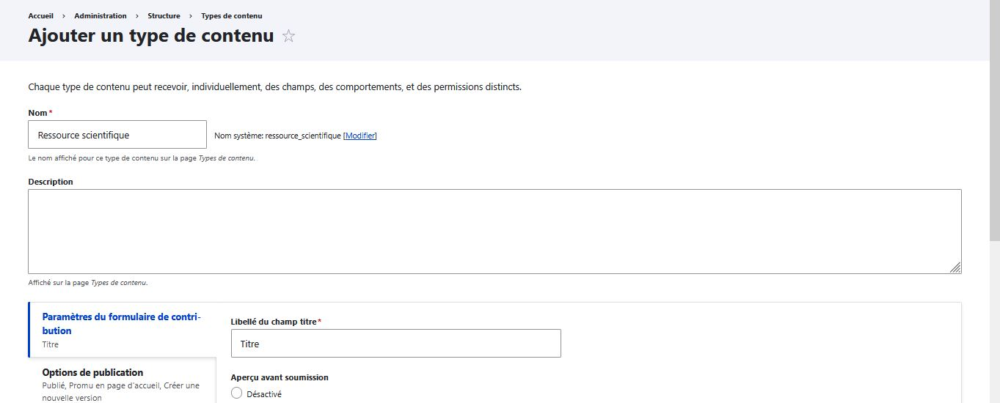
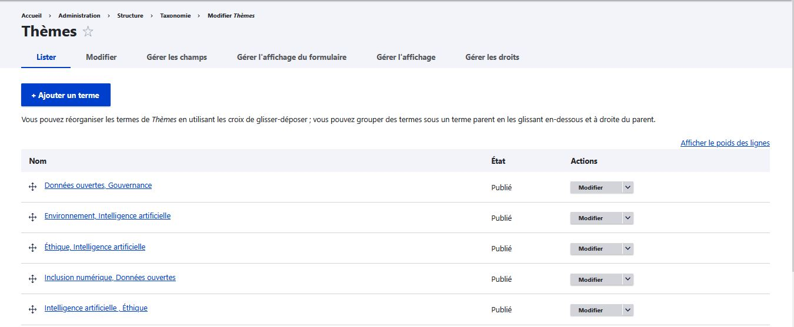
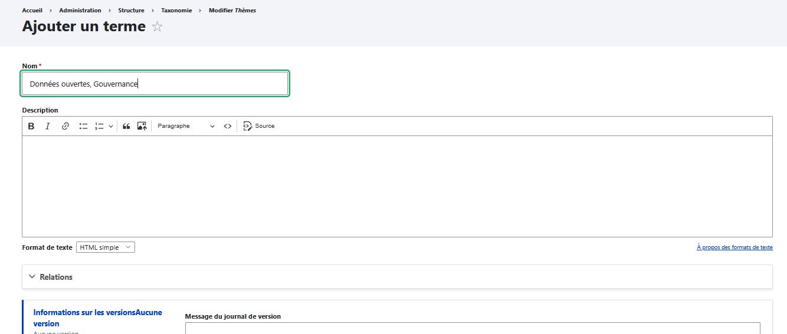
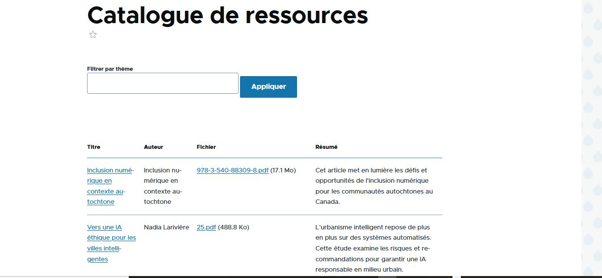
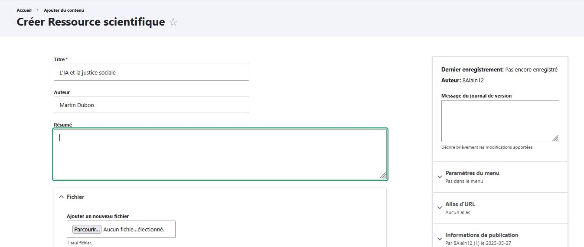

# 📘 Portail de ressources scientifiques — Projet Drupal

Projet démonstratif réalisé pour montrer la maîtrise de Drupal dans un contexte de gestion de ressources scientifiques en lien avec les enjeux sociétaux de l’intelligence artificielle.

---

## 🎯 Objectif

Créer un mini portail Drupal  permettant :
- l’ajout et la classification de ressources scientifiques,
- l’organisation par taxonomie thématique,
- l’affichage structuré avec filtres.

---

## 🧠 Compétences démontrées

- Création de types de contenu personnalisés
- Utilisation de taxonomies
- Configuration de vues avec filtres exposés
- Gestion des fichiers et champs complexes
- Affichage personnalisable (tableaux, fiches, HTML)

---

## 📐 Structure du projet

### 📄 Types de contenu

- `Ressource scientifique` : titre, auteur, résumé, fichier PDF, mots-clés

### 🏷 Taxonomie

- Vocabulaire : `Thèmes`
- Termes : IA, Éthique, Environnement, Données ouvertes, Inclusion numérique

---

## 🔧 Étapes de mise en œuvre

### ✅ Étape 1 : Création du type de contenu `Ressource scientifique`

### ✅ Étape 2 : Création de la taxonomie `Thèmes`

### ✅ Étape 3 : Ajout du champ `Mots-clés`

### ✅ Étape 4 : Création de la vue `Catalogue de ressources`
- Filtres : thème, auteur
- Format : tableau ou liste HTML

### ✅ Étape 5 : Ajout de ressources de test

## 🧾 Auteur

**Alain Kiemde**  
Projet réalisé en mai 2025 dans le cadre d’une démonstration de compétence pour un poste à l’Obvia.

---

> Ce projet met en valeur la capacité à structurer, organiser et présenter efficacement de la recherche scientifique via Drupal.
